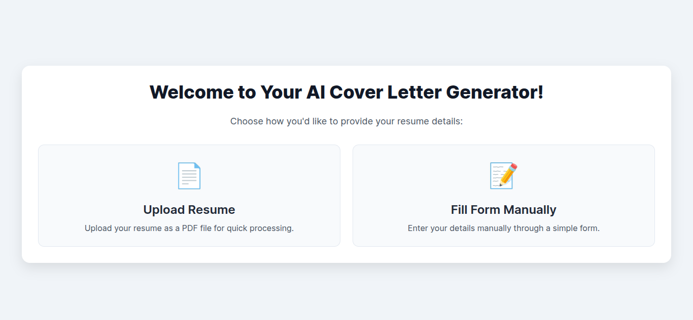
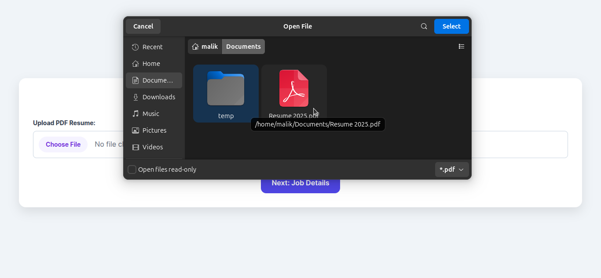
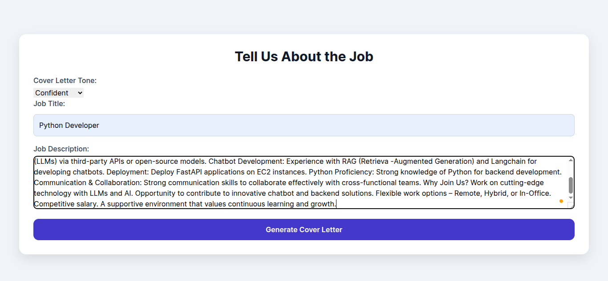
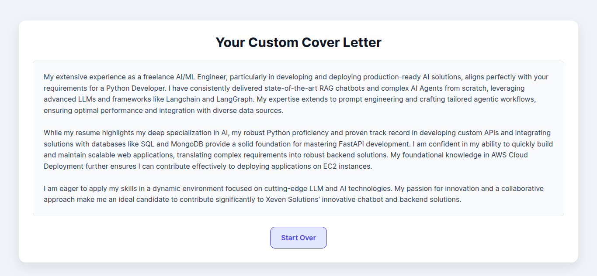

# AI Resume Analyzer & Cover Letter Generator

A FastAPI-based web application with a front end powered by Jinja2 templates and static assets.
This project allows you to upload your resume (PDF) or fill out a form manually, along with a job description, to instantly generate a customized AI‑generated cover letter.

## 📸 Screenshots





## ✨ Features
### Two input modes:
- ✅ Upload a resume in PDF format
- ✅ Or manually enter details (Name, Experience, Skills, Projects, etc.)

### AI‑powered Cover Letter Generation:
- Based on your resume details and the provided job description, the app generates a personalized cover letter.

### Modern Tech Stack:
- Built with FastAPI for the backend, Jinja2 for templating, and served with static front‑end assets.

### Simple to Run with UV:
- Run the project instantly with uv, a modern package/dependency manager and runner.

## 🛠️ Prerequisites
- Python 3.9+

- uv installed on your system
(If not installed, see installation below.)
- A valid Google Generative AI API key from Google Studio (Gemini).

## 📦 Install uv
If you don’t have uv yet, install it globally:

``` bash
pip install uv
# or
pipx install uv 
```

## 🚀 Installation & Run (using uv)
### 1. Clone the repository

``` bash
git clone https://github.com/Malik-Talha/AI-Resume-Analyzer-and-Cover-Letter-Generator.git
cd AI-Resume-Analyzer-and-Cover-Letter-Generator/

```
### 2. Install dependencies with uv
```
uv sync
```
### 3. Add your API key

Create a .env file in the project root:

```
GOOGLE_API_KEY=your_google_api_key_here
```
### 4. Run the app
```
uv run fastapi dev app/main.py
```
or

```
uv run uvicorn app.main:app --reload
```
### 5. Open in browser
    http://127.0.0.1:8000

## 💡 How It Works
#### 1. Go to the home page.

#### 2. Choose to upload your resume (PDF) or fill in your details manually.

#### 3. Enter the job description.

#### 4. Submit and let the AI analyze and generate a tailored cover letter.

## 🛠️ Tech Stack
### Backend: FastAPI, Python 3

### Frontend: Jinja2 Templates, Vanilla JS, CSS

### AI Integration: Google Generative AI (via GOOGLE_API_KEY)

### Server: Uvicorn

## 📄 License
This project is licensed under the MIT License. Feel free to use and modify as needed.
